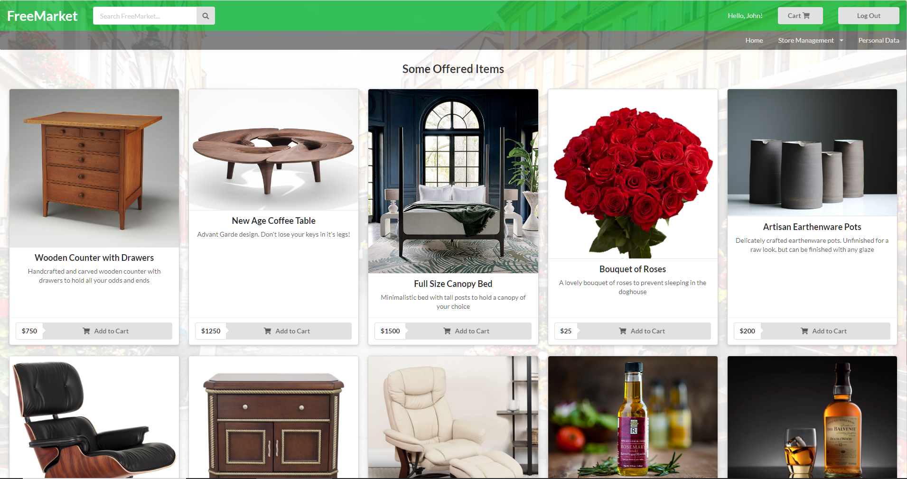

# FreeMarket

## Overview
  This project is called FreeMarket. The point of this project is to learn the ins and outs of creating a Person-to-Person (P2P) E-Commerce site. 

  The application will allow users to both post items to sell and to purchase the items posted by other people.

  As a personal imporovement and interest project, development is ongoing. There is no final release date, and the likelihood of hosting is low. For more information, please see the bottom of this README or visit the [Photos file](/git_photos).

## Initial Goals (Subject to change)
  1. Users will be able to register, log in, and log out.

  2. Users will be able to view the different products available on the site.

  3. Users will be able to create, edit, and delete their own products and manage their own shop.

  4. Users will be able to search the database for certain items.

  5. Users will be able to add and remove items from a cart with a total price at the end.

  6. Users will be able to checkout using their address and payment information.

  7. The site will be reactive.

## Specifications
  The core technology of this project is JavaScript and the MERN stack (MongoDB, Express.js, React.js, Node.js). As there is an increased focus on Front End Development, I wanted to familiarize myself with one of the most popular technologies used today. Out of the three most popular: Angular, React, and Vue, React seemed to be the top.

  For the Front End framework, I decided to use the Semantic UI library. While I could have written custom HTML and CSS, the increase in the usage of existing libraries to design the front end encouraged me to try out a new technology. I had originally wanted to try using this in my FridgeBuddy project, but deadlines prevailed and I was forced to work within Bootstrap, so I am very excited to use the full capabilities this time.

  As mentioned above, for the database, MongoDB will be used. While there are many new NoSQL databases being created nowadays, MongoDB is the most well known. The flexibility of the database, using documents rather than tables, attracted me. I will add however, that looking in retrospect, for this kind of project, I almost feel as if a SQL database would have worked better, but that may just be because of the lack of familiarity with this database. With MongoDB, I will be writing a custom API to access the database. 

  In the case that I decide to host for display purposes, I will most likely be using Amazon AWS-EC2 as I have the most familiarity with it.

## Demo:
  
  
  
  
  

  More photos are available in the [Photography file](/git_photos).